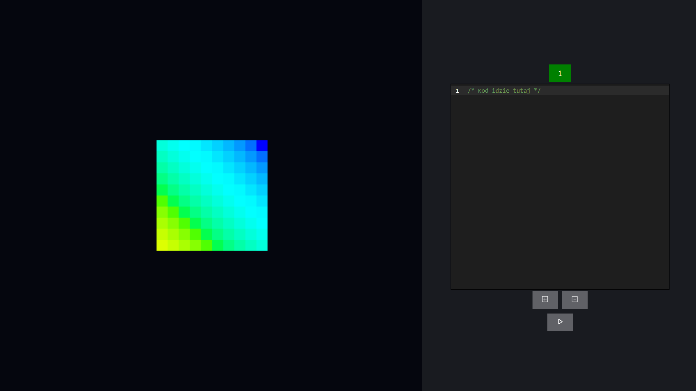

# About project
The Cube 3D project focuses on simulating LED cube animations. The animations are created using code typed in build-in text editor. Thanks to this the simulator is as close as possible to animations performed using microcontrollers. 



# Setup
To run this this project first type: 
```
npm install 
```
This allows you to install all required tools such as three.js. Then type:
```
npm start
```
This command runs the app in the development mode.\
Open [http://localhost:3000](http://localhost:3000) to view it in your browser.

The page will reload when you make changes.\
You may also see any lint errors in the console.
