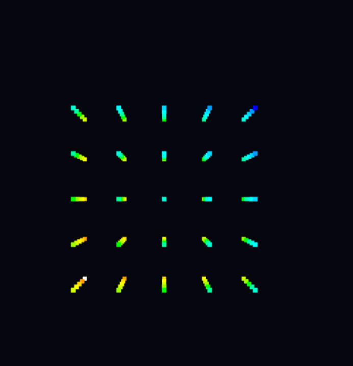
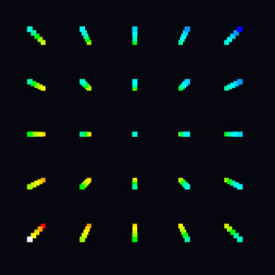
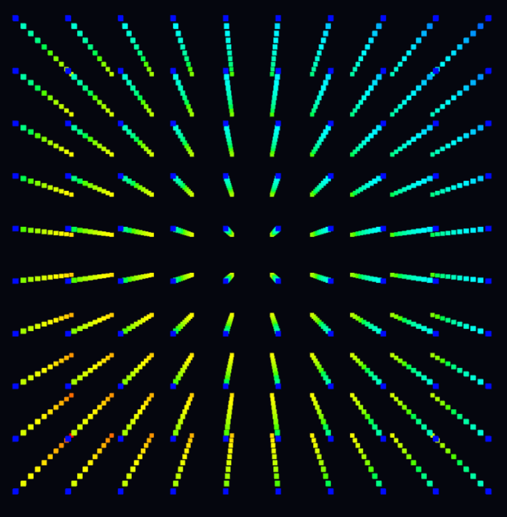

# Welcome to the LedCube Tutorial

## Since LedCube offers the potential for an infinite variety of animations, we’ll guide you through creating a sample animation to introduce the essential elements of animation creation

## Step 1 - Changing Color

Animations in LedCube are based on changing the color of individual LEDs. So, before lighting up the entire cube with a spectrum of colors, let’s first learn how to change the color of a single element.

```javascript
cubes[0][0][0].material.emissive.set(0xffffff); 
```

The elements in our cube are stored in a three-dimensional array called cubes. This is because the cube consists of smaller, independent cubes, allowing us to reference each one by its coordinates. In this example, the simplest way is to refer to the cube at index [0][0][0], located at the position shown in the illustration:



In our application, vectors are labeled as follows: [Z][Y][X]

Therefore, if we want to reference the cube at the front, we need to refer to the highest index on the X-axis. For a 5x5x5 cube, this would be the cube with coordinates [0][0][4]:



It’s a good practice to add a line that sets the color of the cube itself, not just the color of the emitted light. This makes the colors more vivid:

```
cubes[0][0][4].material.color.set(0xffffff);
cubes[0][0][4].material.emissive.set(0xffffff); 
```

As you can see, colors are set using hexadecimal values. If we want to set the color of our cube to navy blue, we would write it as: 0x0005d2.

## Step 2 - Referencing Multiple Cubes

As you may notice, lighting up a single cube is not very visible or satisfying. It’s time to light up more cubes. To start, we’ll make one side of the cube light up in white. To do this, we just need to create a simple for loop:

```
let wallCount = cubes.length;
let lastWall = wallCount - 1;

for (let y = 0; y < wallCount; y++) {
  for (let z = 0; z < wallCount; z++) {
    cubes[z][y][lastWall].material.color.set(0x0005d2);
    cubes[z][y][lastWall].material.emissive.set(0x0005d2); 
  }
}
```



As shown above, the entire front wall has changed color to navy blue. Note that the cube shown above is a 10x10x10. LedCube allows you to work with cubes of various sizes, so it’s good practice to reference the size of the cubes array containing all the cubes, ensuring the code works regardless of the dimensions.

## Step 3 - Using Time

For our animation to be fully functional, it’s missing one thing—time changes. To create an animation rather than static images, we need to add time intervals. Fortunately, we can use the built-in setTimeout() function to achieve this. To make it work, we must provide the function we want to execute as the first parameter, and the delay time in milliseconds as the second parameter. To demonstrate how it works, let’s make a small change to the code from the previous step:

```
let wallCount = cubes.length;
let lastWall = wallCount - 1;

setTimeout(() => {
  for (let y = 0; y < wallCount; y++) {
    for (let z = 0; z < wallCount; z++) {
      cubes[z][y][lastWall].material.color.set(0x0005d2);
      cubes[z][y][lastWall].material.emissive.set(0x0005d2); 
    }
  }
}, 1000);
```

After running this code, we create a simple animation where the front wall lights up in navy blue after one second.

## Step 4 - A Full Animation

Since LedCube provides unlimited animation possibilities, we’ve focused on the most important specifics in this tutorial. To wrap up, we’ll present a simple, complete animation. Here’s the code:

```
let currentWall = 0;

function animateWalls() {
  for (let i = 0; i < cubes.length; i++) {
    for (let j = 0; j < cubes.length; j++) {
      for (let k = 0; k < cubes.length; k++) {
        const cube = cubes[i][j][k];
        const color = (k === currentWall) ? 0xFFFFFF : 0x202020;
        cube.material.color.set(color);
        cube.material.emissive.set(color);
      }
    }
  }

  currentWall = (currentWall + 1) % cubes.length; 
  setTimeout(animateWalls, 200); 
}

animateWalls();

```

As you can see, we created a recursion function named animateWalls. Its operation is based on for loops, which we use to change the color of successive walls. The result of running this code is the following animation:


