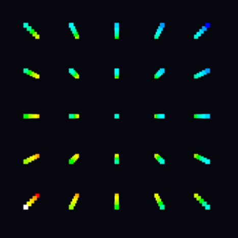

# Witaj w samouczku LedCube!

## ponieważ LedCube zapewnia pole do nieskończenie wielu animacji przedstawimy tutaj proces tworzenia przykłądowej animacji która będzie zawierała najważniejsze elementy tworzenia animacji.


## Krok 1 - zmiana koloru

Animacje tworzone za pomocą LedCube opierają się na zmianach koloru pojedynczego leda. Zatem, zanim sprawimy, by cała kostka zaświeciła się całą paletą barw nauczmy się najpierw jak zmienić kolor pojedynczego elementu.

```
cubes[0][0][0].material.emissive.set(0xffffff); 
```
Elementy w naszej kostce przechowywane są w tablicy trójwymiarowej o nazwie cubes. Dzieje się tak, ponieważ kostka składa się z mniejszych, niezależnych kostek. Dzięki temu, możemy odwołać   się do każdej z nich za pomocą jej współrzędnych. Dla tego przykładu najprościej będzie odwołać się do kostki o indeksie `[0][0][0]` co oznacza, że jest to kostka znajdująca się w miejscu ukazanym na ilustracji:


W przypadku naszej aplikacji wektory oznaczone są następująco: `[Z][Y][X]`

Zatem, jeżeli chcemy się odwołać do kostki znajdującej się z przodu musimy odwołać się do najwyższego indexu na osi X, w przypadku kostki 5x5x5 będzie to kostka o współrzędnych `[0][0][4]`:



Dobrą praktyką jest dopisanie linijki odnoszącej się do koloru samej kostki, a nie tylko do koloru emitowanego światła. Sprawi to, że kolory będą intensywniejsze:
```
cubes[0][0][4].material.color.set(0xffffff);
cubes[0][0][4].material.emissive.set(0xffffff); 
```
Jak można zauważyć, kolory ustalamy odnosząc się do wartości heksadecymalnych. Jeżeli chcemy ustawić kolor naszej kostki jako granatowy powinniśmy zatem zapisać go w ten sposób: `0x0005d2`

## Krok 2 - odwołanie się do wielu kostek

Jak można zauważyć, zaświecenie jednej kostki jest mało widocznym i satysfakcjonującym procesem. Pora, abyśmy zaświecili więcej kostek. Na początek, sprawimy, że jedna ze ścian zaświeci się na biało. W tym celu wystarczy utworzyć prostą pętlę for:
```
let wallCount = cubes.length;
let lastWall = wallCount - 1;

for (let y = 0; y < wallCount; y++) {
  for (let z = 0; z < wallCount; z++) {
    cubes[z][y][lastWall].material.color.set(0x0005d2);
    cubes[z][y][lastWall].material.emissive.set(0x0005d2); 
  }
}
```


Jak widać powyżej, cała przednia ściana zmieniła swój kolor na granatowy. Należy zauważyć, że została powyżej przedstawiona kostka 10x10x10. LedCube pozwala na operowanie na kostkach o różnych wymiarach, zatem dobrą praktyką jest odnoszenie się do wielkości tablicy `cubes` zawierającej wszystkie kostki, by kod działał niezależnie od wymiarów.

## Krok 3 - wykorzystanie czasu

Aby nasza animacja byłą w pełni funkcjonalna brakuje nam jednej rzeczy - zmiana w czasie. Aby stworzyć animację, a nie statyczne obrazy. Na szczęście, aby to wykonać wystarczy użyć wbudowanej funkcji `setTimeout()`. Aby działała, musimy jako pierwszy parametr podać funkcję którą chcemy wykonać, a jako drugi czas w milisekundach jaki chcemy odczekać. Aby zaprezentować działanie funkcji możemy wprowadzić małą zmianę do kodu z poprzedniego kroku: 
```

let wallCount = cubes.length;
let lastWall = wallCount - 1;

setTimeout( () => {
  for (let y = 0; y < wallCount; y++) {
  for (let z = 0; z < wallCount; z++) {
    cubes[z][y][lastWall].material.color.set(0x0005d2);
    cubes[z][y][lastWall].material.emissive.set(0x0005d2); 
  }
}

}, 1000)
```
Po uruchomieniu tego kodu powstanie prosta animacja, w której przednia ściana zapala się na granatowo po upływie jednej sekundy.

## Krok 4 - prawdziwa animacja

Ponieważ LedCube gwarantuje nieograniczone możliwości tworzenia animacji przygotowując ten samouczek musieliśmy skupić się na najważniejszych konkretach. W ramach zakończenia przedstawimy prostą, pełnoprawną animację. Jej kod prezentuje się następująco:

```
let currentWall = 0;

function animateWalls() {
  for (let i = 0; i < cubes.length; i++) {
    for (let j = 0; j < cubes.length; j++) {
      for (let k = 0; k < cubes.length; k++) {
        const cube = cubes[i][j][k];
        const color = (k === currentWall) ? 0xFFFFFF : 0x202020;
        cube.material.color.set(color);
        cube.material.emissive.set(color);
      }
    }
  }

  currentWall = (currentWall + 1) % cubes.length; 
  setTimeout(animateWalls, 200); 
}

animateWalls();
```
Jak widać utworzyliśmy rekurencje o nazwie `animateWalls`. Jej działanie opiera się na pętlach `for` których używamy do zmiany koloru kolejnych ścian. W wyniku działania tego kodu otrzymujemy poniższą animację:


